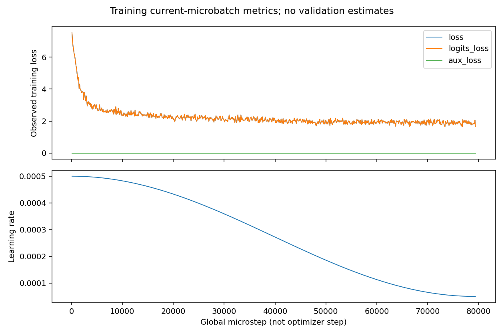
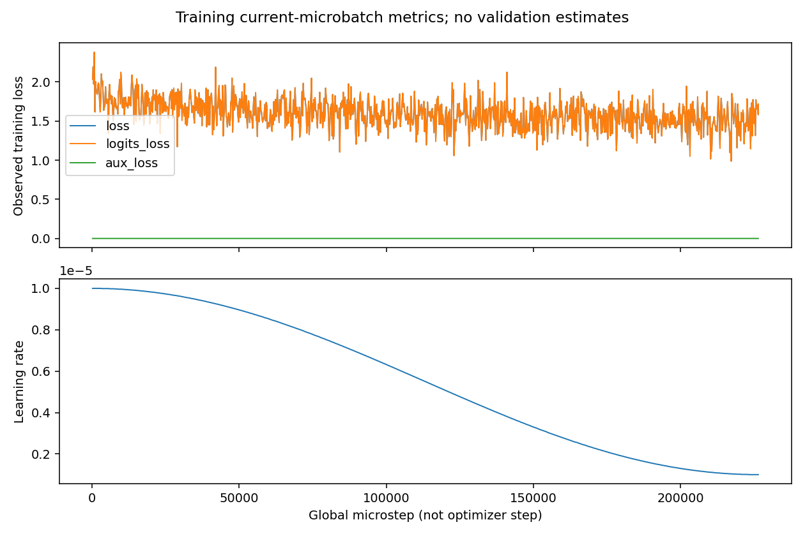

# evomind

**面向个人 GPU 的轻量语言模型与视觉理解项目。**

[项目介绍](#项目介绍) · [快速开始](#快速开始) · [训练数据](#训练数据) · [实验结果](#实验结果) · [视觉分支](https://github.com/HuanYn/evomind/tree/evomind-v)

## 项目介绍

evomind 围绕一个目标展开：**把文本模型训练、后训练、评测选择和视觉扩展连成可运行、可追溯的工程流程。**

项目以约 **64M 参数的 Dense 语言模型**为文本核心，从预训练和指令微调开始，通过偏好优化与在线强化学习探索回答质量改善，再向图像与视频理解推进。训练之外，同样重视断点恢复、数据完整性、模型退化诊断和实验记录，避免只有模型文件而没有可解释的结果。

### 项目工作

- **端到端训练管理**：串联预训练、SFT、DPO 与 CISPO，记录初始化关系，按评测结果选择下一阶段基座。
- **可恢复训练**：在完整参数更新边界保存模型、优化器及随机状态，用配置与文件哈希检查恢复条件。
- **统一评测**：保留七项中英文客观任务，以及问答、思考开关、工具调用示例；原始输出与协议一起落盘。
- **视觉输入扩展**：实现单图、全图加 2×2 局部视图，以及冻结视觉编码器特征缓存。
- **数据完整性**：固定数据版本，记录 SHA256；视觉数据按原始图片分组，防止同一图片跨划分。
- **实验可追溯**：保存原始指标、曲线和失败记录，不用短程预检代替正式训练，不预填未产生的收益。

> **2026-09-09 发布快照**：预训练与 SFT 已完成；DPO 已完成 4,292 次参数更新，评测进行中。CISPO 处于硬件预检阶段，视觉正式训练及视频能力尚未完成。当前提供源码，不提供未经验证的模型下载或在线体验承诺。

## 技术路线

```text
预训练 → SFT → DPO → 评测选择 SFT / DPO
                         ↓
                       CISPO → 评测选择父模型 / CISPO
                                           ↓
                                      图文 → 视频
```

**是否采用后训练模型，由评测决定，而不是由训练结束或 reward 上升决定。** DPO 不满足条件时，CISPO 仍从 SFT 出发；CISPO 未改善时，保留父模型。Agent-CISPO 为后续工具扩展，不阻塞视觉主线。

当前暂缓 LoRA、独立 GRPO 与蒸馏；PPO、Agent-GRPO 不在执行计划内。仓库保留相关代码不代表它们都已完成实验。

## 模型结构

```text
文本 → Tokenizer → Embedding
                    ↓
       8 × [RMSNorm → GQA → 残差
            RMSNorm → SwiGLU → 残差]
                    ↓
             RMSNorm → LM Head
                    ↓
                下一个 token
```

| 配置 | 当前文本模型 |
|---|---:|
| 结构 | Dense、Decoder-only |
| 参数量 | 63,912,192 |
| 隐藏维度 / 层数 | 768 / 8 |
| Q 头 / KV 头 | 8 / 4 |
| 每头维度 | 96 |
| FFN 中间维度 | 2,432 |
| 词表大小 | 6,400 |
| 位置编码 | RoPE |
| 归一化 / FFN | RMSNorm / SwiGLU |
| 输入输出权重 | 共享 |

这不是早期 19M 参数、16K tokenizer 的实验版本，两者权重和 token ID 不能混用。配置允许的位置长度也不等于已经验证的长上下文能力。

## 训练数据

| 阶段 | 数据文件 | 源文件条数 | 使用方式 |
|---|---|---:|---|
| 预训练 | `pretrain_t2t_mini.jsonl` | 1,270,238 | 完整文件，2 epoch |
| SFT | `sft_t2t_mini.jsonl` | 905,718 | 完整文件，2 epoch |
| DPO | `dpo.jsonl` | 17,166 | 完整偏好对文件，1 epoch |
| CISPO | `rlaif.jsonl` | 19,502 | 完整问题文件，计划 1 epoch |
| 图文 | `sft_i2t.parquet` | 2,904,511（扫描） | 完成预处理，正式训练待执行 |

文本文件由 [minimind_dataset](https://huggingface.co/datasets/jingyaogong/minimind_dataset)提供，图文文件由 [minimind-v_dataset](https://huggingface.co/datasets/jingyaogong/minimind-v_dataset)提供。数据属于公开资源，不声称由本项目采集或独占。文本 mini 文件固定 revision 为 `312afb4f76391145c6902f765bb51691c09a12f5`；下载器保留版本、SHA256 和条数记录。

视觉预处理接受 **2,654,826 条对话**，按原始图片字节 SHA256 分组，拒绝不支持的图片标记、空答案与部分工具/推理格式。接受条数不是已训练条数。检查规则见[视觉数据说明](docs/VISION_PREPARATION_REVIEW.md)。

在线后训练使用冻结的 [InternLM2-1.8B-Reward](https://huggingface.co/internlm/internlm2-1_8b-reward)评分器。它与训练中的语言模型是两个模型；reward 不等于正确率。原始数据和大模型权重不上传 Git。

## 快速开始

### 1. 获取文本代码

克隆主分支；此步骤不会启动训练或下载权重。

```bash
git clone --branch main https://github.com/HuanYn/evomind.git
cd evomind
```

### 2. 准备环境

先在独立环境中安装与显卡匹配的 PyTorch，再安装依赖。以下命令只安装依赖：

```bash
python -m pip install -r requirements.txt
python -m pip install matplotlib lm_eval==0.4.13
```

`requirements.txt` 不是跨平台验证完成的锁文件。训练使用 Transformers 4.57.6、Datasets 3.6.0，CUDA/PyTorch 版本随设备记录。服务器 Python 3.13 的奖励分词器已验证 SentencePiece 0.2.1；0.2.2 曾加载失败。不要修改正在运行任务的共享环境。

### 3. 下载训练数据

下载并校验固定版本的预训练/SFT 文件，同时记录来源；需要网络与磁盘空间。

```bash
python -B scripts/evomind_prepare_assets.py text
```

### 4. 执行训练计划

先检查[文本训练配置](configs/text_official_mini.json)的路径与显存预算。下面的命令会执行配置中的预训练、SFT，并衔接后续流程，**不只是跑一次推理**：

```bash
python -B scripts/evomind_run.py --manifest configs/text_official_mini.json
```

恢复既有运行时才添加 `--resume`，不要启动重复 supervisor。后训练还需要对应数据、奖励模型和资源校验记录；未准备齐全会拒绝推进。配置包含当前部署路径，迁移机器前需调整，不保证克隆后无需配置即可全程运行。

| 阶段 | epoch | micro batch × 梯度累积 | 长度 | 学习率 |
|---|---:|---:|---|---:|
| 预训练 | 2 | 32 × 8 | 340 | 5e-4 |
| SFT | 2 | 8 × 2 | 768 | 1e-5 |
| DPO | 1 | 4 × 1 | 1,024 | 4e-8 |
| CISPO（计划） | 1 | 2 × 1 | prompt 768 / generation 1,024 | 3e-7 |

CISPO 每个问题生成 6 个回答。显存回退仅调整配置中允许的 batch/累积，不静默削减数据、回答数或生成长度。完整设置与模型选择条件见 [product_pipeline.json](configs/product_pipeline.json)。

### 5. 运行评测

以下命令对已有 SFT 权重执行固定问答，记录完整回答、EOS 与重复率，不更新模型参数：

```bash
python -B scripts/evomind_text_eval.py --checkpoint out/full_sft_768.pth --output-dir artifacts/evaluation/manual_sft
```

以下命令运行完整 C-Eval 验证集；更换 `--task` 可运行其余任务：

```bash
python -B scripts/evomind_harness_eval.py --checkpoint out/full_sft_768.pth --task ceval-valid --output-dir artifacts/evaluation/manual_sft_ceval
```

不要把不同 checkpoint 或不同评测协议写入同一输出目录。

## 实验结果

### 中英文客观评测

协议：lm-evaluation-harness 0.4.13、任务默认 few-shot、完整 split、启用聊天模板、关闭 thinking、FP16、batch 1、seed 42。保留代码、任务、tokenizer 和检查点哈希。

| 任务 | SFT acc | SFT acc_norm | DPO | CISPO |
|---|---:|---:|---|---|
| C-Eval valid | 22.81% | 22.81% | 待汇总 | 待训练/评测 |
| CMMLU | 25.02% | 25.02% | 待汇总 | 待训练/评测 |
| ARC-Easy | 29.92% | 31.06% | 待汇总 | 待训练/评测 |
| PIQA | 54.08% | 52.45% | 待汇总 | 待训练/评测 |
| OpenBookQA | 15.20% | 29.60% | 待汇总 | 待训练/评测 |
| HellaSwag | 26.98% | 27.58% | 待汇总 | 待训练/评测 |
| Social IQa | 34.65% | — | 待汇总 | 待训练/评测 |

`acc` 与 `acc_norm` 分开展示，“—”表示没有该字段。精确数值和评测配置见[公开结果快照](docs/results/sft_20260909.json)。完整逐题记录保存在运行产物中，尚未随源码发布。

固定 8 问、非思考模式的 SFT 诊断：EOS **8/8**，平均 token repeat-4 **0.1472**，distinct-2 **0.6787**。能结束、少复读，不代表内容正确；8 个案例不证明泛化能力。当前中文知识任务成绩仍低，不将模型宣传为可靠知识问答系统。

没有在同一协议下完整复测其他项目权重，因此不作跨项目优劣结论。

### 训练曲线

图片来自本项目真实运行记录。图例区分 attempt 和步数；microbatch 训练 loss 不是验证 loss，恢复前后重复区间不算额外训练量。

**预训练**



**SFT**



DPO/CISPO 曲线与统一结果在记录校验后补充，不用占位数值绘制假曲线。以上为发布快照，不随后台训练自动刷新。

### 产物与可追溯性

```text
artifacts/
├── provenance/      数据、权重来源与校验值
├── runs/            每次运行的配置、日志、原始指标与曲线
└── evaluation/      完整回答、逐题结果、协议与汇总
```

训练产物留在运行机器，源码仓库不包含 checkpoint。带生成时间的[技术报告](EVOMIND_TECHNICAL_REPORT.md)为历史快照，可能滞后于当前运行；未完成的结果明确标记待测。

## 视觉与视频

视觉代码单独维护于 [evomind-v](https://github.com/HuanYn/evomind/tree/evomind-v)。文本配置使用 `vision/` 路径时，可在文本仓库中执行下列命令，仅获取代码，不启动视觉训练：

```bash
git clone --branch evomind-v --single-branch https://github.com/HuanYn/evomind.git vision
```

已存在 `vision/` 时不要重复克隆。

| 对照 | 视觉输入 | 编码方式 | 状态 |
|---|---|---|---|
| A | 单张全图 | 在线冻结编码器 | 待正式训练 |
| B | 全图 + 2×2 局部视图 | 在线冻结编码器 | 待正式训练 |
| C | 与 B 相同 | 缓存冻结编码器输出 | CPU 测试通过，GPU 效率待验证 |

缓存不包含可训练 projector 的输出；B/C 保持同一视觉 token 预算。A/B 并非等 token 算力对照；加速评估需计入首次缓存成本。多视角与缓存是工程扩展，不预设它们必然改善质量或速度。

视频数据、帧采样、时序输入与视频评测仍待实现。多张图像裁剪不等于视频模型，图像训练完成也不等于视频能力完成。

## 目录

```text
model/       模型结构、配置、tokenizer
dataset/     数据加载（原始语料不入 Git）
trainer/     训练入口、可恢复运行时
scripts/     数据准备、流水线、评测、报告
configs/     训练配置与模型选择条件
test/        数据、恢复、评测协议等测试
docs/        技术说明、公开曲线与结果
```

## 开发计划

- [x] 文本预训练与 SFT
- [x] 全量 DPO 训练
- [x] SFT 七项中英文客观评测
- [ ] DPO 评测与下一阶段基座选择
- [ ] CISPO 正式训练与评测
- [x] 视觉数据处理与多视角/缓存代码
- [ ] 图文训练与视觉对照实验
- [ ] 视频数据、训练与评测
- [ ] 权重发布、演示与最终报告

## 许可

见 [LICENSE](LICENSE) 与 [NOTICE.md](NOTICE.md)。数据和外部权重遵守各自发布方的使用条件。
