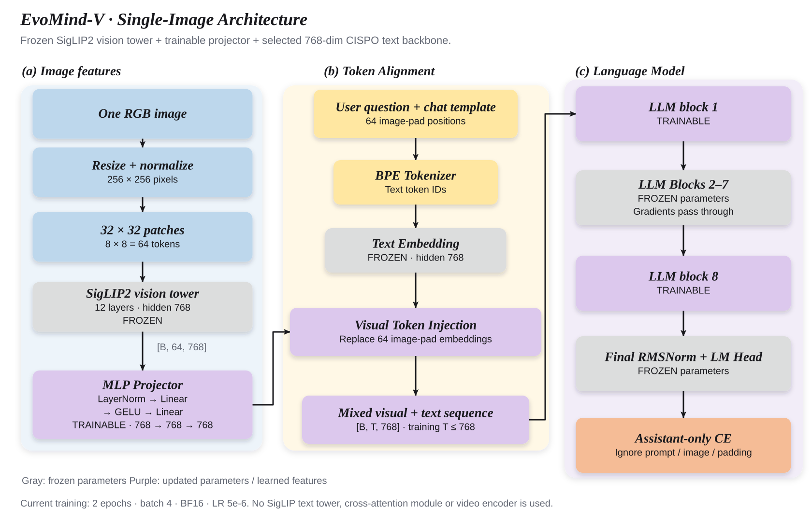
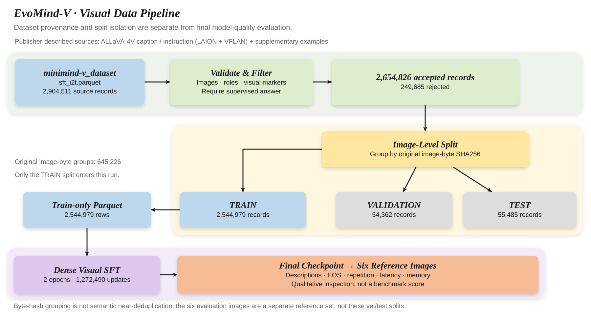

# EvoMind-V

**从可追溯的文本基座出发，搭建轻量单图视觉语言模型。**

[文本主分支](https://github.com/HuanYn/evomind/tree/main) · [模型实现](model/model_vlm.py) · [原生视觉 SFT](trainer/train_sft_vlm.py) · [数据来源账本](docs/VISUAL_DATA_SOURCES.md) · [插图与源文件](figures/README.md)

我在 EvoMind 文本实验的基础上接入视觉编码器和 projector，围绕数据来源、图像分组隔离、参数冻结、完整断点恢复及生成评测建立一条可复现的单图训练链路。这个分支记录模型怎样训练、结果怎样产生，以及目前的证据还不能说明什么。

## 一、项目范围与交付状态

本期固定为 **Dense 单图 V1**：已验收文本基座 → 单图视觉 SFT → 原定六图生成评测 → 单图网页推理 → 技术报告。多图、视频和 MoE 视觉对照留作后续扩展，不计入本期完成项。

| 环节 | 当前已具备的内容 | 尚需完成 |
|---|---|---|
| 文本初始化 | 已选定并校验 CISPO 文本权重；权重摘要与验收回执绑定 | 不重新训练文本基座 |
| 数据 | 全量清点、格式过滤、图像分组划分、训练 Parquet 导出 | 不将来源账本等同于逐条语义质量审核 |
| Dense 单图训练 | 真实数据预检通过；全量两轮训练与断点续训链路已启动 | 完整两轮训练结束回执、最终权重和曲线 |
| 六图评测 | 固定输入、生成参数及可追溯记录入口 | 最终权重的六图结果与解读 |
| 单图网页 | 原生不可变快照预览入口草稿 | CPU 测试、真实模型联调及最终权重接入；尚未验收 |
| 技术报告 | 架构、数据谱系、训练配方和评价口径 | 最终数值、样例和交付验收 |

这里的“已启动训练”不代表模型已经完成；中间 checkpoint 的回答也不替代最终验收。当前没有宣称通过质量验收的最终视觉权重。

**本次发布范围：README、数据来源说明和架构/数据流程插图。** 下文提及的新增 runtime 恢复链、性能探测、最终评测守卫和网页草稿仍是本地运行扩展，本次文档发布不包含这些代码或内部报告。仓库已跟踪的原生模型、数据准备与单图启动入口继续保留；不要将本地扩展的路径说明误当作可直接运行的公开下载内容。

## 二、模型结构：图片怎样进入语言模型



**图 1｜当前实际运行的单图结构。** 一张图片经过固定分辨率的视觉塔，得到 64 个特征向量；projector 将它们映射到语言模型的表示空间，再替换输入中 64 个图像占位 token 的 embedding。语言模型读取图像与文本的联合序列，预测 assistant 的回答。图中的冻结与更新范围对应当前 `freeze_llm=1`，不是所有视觉 SFT 方法的通用配置。

实现依据：[视觉模型与 projector](model/model_vlm.py)、[配置与预处理文件的版本/摘要](docs/VISUAL_DATA_SOURCES.md)、[语言模型](model/model_minimind.py)、[冻结策略](trainer/trainer_utils.py)。视觉权重目录不随代码分发，固定外部资源链接列在文末。

### 2.1 视觉塔：256 像素输入，64 个视觉 token

| 项目 | 本项目使用的配置 |
|---|---|
| 编码器 | SigLIP2 ViT-B/32 的视觉塔，不加载其文本塔 |
| 输入 | RGB 图片，resize 到 `256 × 256`，再做归一化 |
| Patch | `32 × 32`，形成 `8 × 8 = 64` 个 patch |
| 视觉 Transformer | 12 层、12 个注意力头、hidden size 768 |
| 特征输出 | `last_hidden_state`，形状 `[B, 64, 768]` |
| 更新策略 | 全部冻结，eval 模式，特征提取使用 `no_grad` |

当前代码是**固定分辨率版本**，不是动态分辨率/NaFlex 实现；也没有把图像压缩成一个全局向量。64 个位置各自保留视觉特征，供后面的语言模型读取。

### 2.2 Projector：维度相同，仍需要学习映射

当前 projector 的逐层结构为：

```text
[B, 64, 768]
  → LayerNorm(768)
  → Linear(768, 768)
  → GELU
  → Linear(768, 768)
  → [B, 64, 768]
```

视觉特征和文本 embedding 都是 768 维，并不意味着两者的语义坐标已经一致。这里的可训练 MLP 学习把视觉塔的表示转换为语言模型能利用的表示；它**不减少 token 数**，也不是把 64 个向量平均池化成一个向量。

文本模板先预留连续 64 个 `<|image_pad|>`。模型将这些位置的 embedding 替换为投影后的视觉特征，而不是在 64 个占位符之外再增加 64 个 token。视觉塔只在生成的 prefill 阶段计算图像特征，后续解码复用语言模型的 KV Cache。

### 2.3 哪些参数训练，哪些参数冻结

语言模型为 **hidden size 768、8 层 Dense、8 个 Q 头、4 个 KV 头**，每个注意力头 96 维，词表大小为 6,400。它使用 RMSNorm、RoPE、GQA 和门控 FFN；这些配置来自当前原生模型，而不是早期 384 维实验。

| 模块 | 当前视觉 SFT 是否更新 |
|---|---|
| SigLIP2 视觉塔 | 冻结 |
| Projector | **更新** |
| 第 1、8 个语言解码器块（代码索引 0、7） | **更新** |
| 第 2–7 个语言解码器块（代码索引 1–6） | 冻结 |
| 文本 embedding、最终 norm、LM head 等其余语言参数 | 冻结 |

冻结中间块的参数，不等于删掉这些块，也不等于训练时不经过它们。它们仍参与前向计算，梯度需要经过冻结的运算路径回传到前面可训练的模块。

本期直接进行一阶段视觉 SFT，**没有另跑一个独立的 caption-only 视觉预训练阶段**。所用 SFT 数据包本身已经混入上游 caption 数据，不能再把这部分当作额外训练轮次重复计算。

## 三、数据来源与处理：从 290 万行到 254 万条训练样本



**图 2｜上游来源说明与本地可验证处理链。** 上游发布说明将数据归于 ALLaVA-4V 系列 caption/instruction 数据及补充指令、文本占位样本；本地从固定 revision 的 `sft_i2t.parquet` 开始，能够核验文件摘要、格式过滤、逐样本源行号、图片字节哈希和分组划分。图中上游构成是发布者说明，不是本项目重新统计的逐子源占比。

本地证据与边界见 [数据来源账本](docs/VISUAL_DATA_SOURCES.md)；处理逻辑见 [prepare_evomind_v_data.py](scripts/prepare_evomind_v_data.py) 和 [evomind_v/data.py](evomind_v/data.py)。

两张视觉插图的 [SVG、PNG、PDF、可编辑图源及重建说明](figures/README.md) 一并保留。

### 3.1 实际清点结果

| 处理阶段 | 对话记录数 | 不同图片字节哈希组数 |
|---|---:|---:|
| 原始 `sft_i2t.parquet` | 2,904,511 | 未在本表统计 |
| 不符合本期输入契约，剔除 | 249,685 | — |
| 接受的单图对话 | **2,654,826** | **645,226** |
| Train | **2,544,979** | 619,092 |
| Validation，保留 | 54,362 | 13,098 |
| Test，保留 | 55,485 | 13,036 |

划分以**原始图片字节的 SHA256** 为组键，seed 为 42，验证和测试各设 2% 的哈希区间；不是把对话行随机打散。同一图片的不同问题或描述必须进入同一分区，避免这类直接的跨分区泄漏。由于一张图片可能对应多条对话，最终对话行数比例不必恰好是 96%/2%/2%。

这里不是把 265 万条对话“去重成 64 万条训练数据”。同图多问保留；图片按字节哈希去重复存储并分组。没有实施感知近重复图片检测、语义近重复对话去重，也没有据此证明这些图片从未被外部视觉编码器见过。

### 3.2 过滤了什么

| 拒绝原因 | 行数 |
|---|---:|
| 原始 `<image>` 标记数量不是恰好一个 | 228,755 |
| 图片标记出现在非 user 轮次 | 19,422 |
| 不支持的 tools/reasoning 字段 | 1,503 |
| 不支持的非空 reasoning 内容 | 2 |
| 空 assistant 答案 | 3 |
| **合计** | **249,685** |

这些是**当前单图训练契约的格式筛选**，不应全部称为低质量数据。尤其不能把“图片标记数量不符”的 228,755 行直接等同于精确的纯文本子集计数。源包含中英文内容，但本次没有逐条统计语言占比。

导出的 `evomind_official_train.parquet` 只包含接受的 train 图片组，保留其原始 Arrow 行结构；manifest 另外记录规范化对话、源行号、sample ID 和图片摘要。数据不是通过复制 val/test 回填而扩大到训练规模。

### 3.3 训练时的拼接、截断与 mask

原生 [VLMDataset](dataset/lm_dataset.py) 将图文对话按聊天模板拼接，展开图像占位位置，并构造 assistant-only labels：system、user、图像占位及 padding 不作为预测目标；assistant 的有效回答及保留下来的结束标记参与监督。

当前训练上限为 **768 token 的总输入序列**，其中也包含 64 个视觉占位 token。原生数据集在超长时右截断、短样本右 padding；**不会在截断后补造 EOS**，也不能保证每条长回答都保留完整结尾。这个原生截断路径与历史 A/B/C 控制实验的样本选择逻辑不同，不能混用两套统计结论。

## 四、训练配方与可复现运行

### 4.1 固定配方

| 参数 | 当前正式单图配方 |
|---|---|
| 文本初始化 | 验收选中的 CISPO Dense 权重，按 SHA256 校验 |
| 数据 | 2,544,979 条图像分组隔离后的 train 记录 |
| Epoch | **2** |
| Micro batch / gradient accumulation | **4 / 1**，有效 batch **4** |
| 每轮 optimizer updates | `ceil(2,544,979 / 4) = 636,245` |
| 总 optimizer updates | **1,272,490** |
| 总样本访问次数 | **5,089,958** |
| 序列长度 / 数值格式 | 768 / BF16 |
| 优化器 / 梯度裁剪 | AdamW / 1.0 |
| 学习率 | `5e-6`，原生 cosine 衰减至约 `5e-7`；此视觉配方没有 warmup |
| 随机种子 | 42 |
| 可训练模块 | Projector + 第 1、8 个语言解码器块 |

每轮最后不足 4 条的 batch 仍产生一次更新，因此总步数不是对总样本访问次数简单向下取整。Dense 的有效训练目标是 assistant-only next-token CE；不能套用 MoE 的非零 router 辅助损失解释这条训练曲线。

### 4.2 环境与数据准备

在文本仓库根目录获取视觉分支；已有 `vision/` 时不要重复克隆：

```bash
git clone --branch evomind-v --single-branch https://github.com/HuanYn/evomind.git vision
```

后续命令均在 `vision/` 内运行。环境使用支持 BF16 的 CUDA PyTorch、Transformers 4.57.6、Datasets 3.6.0，以及 PyArrow、Pillow、NumPy。需事先准备 `model/` 下的分词器、`model/siglip2-base-p32-256-ve/` 下的编码器和 `dataset/sft_i2t.parquet`；本启动器不自动下载大文件。

仅在新的复现工作目录中执行全量数据准备，不覆盖正在训练使用的数据：

```bash
python scripts/prepare_evomind_v_data.py --parquet dataset/sft_i2t.parquet --output-dir dataset/evomind_split --seed 42 --val-fraction 0.02 --test-fraction 0.02 --official-train-parquet dataset/evomind_official_train.parquet
```

不传 `--max-rows` 表示扫描全量源文件。`--official-train-parquet` 导出原生训练器可读取的 train-only 文件；分区与过滤报告写入 `summary.json`，逐样本谱系写入 `manifest.jsonl`。固定文件版本和摘要见 [数据来源账本](docs/VISUAL_DATA_SOURCES.md)。

### 4.3 启动独立训练

以下为 Bash 示例。将占位符换成自己的验收回执、匹配权重和已授权 GPU UUID；它用于**新的独立复现**，不是重复启动本项目现有训练：

```bash
python scripts/launch_dense_single.py \
  --acceptance '<product_acceptance.json 路径>' \
  --init-weights '<验收选中的文本权重路径>' \
  --data dataset/evomind_official_train.parquet \
  --data-sha256 701a0da67ea63b7603092c78f912e89ed5ca4549659b4ffa2587a9d8762cab58 \
  --run-dir artifacts/dense_single_example \
  --gpu-uuid '<已授权且空闲的完整 GPU UUID>'
```

`--acceptance` 要求状态为 `accepted_text_screening`；`--init-weights` 的摘要必须匹配回执的 `selected.sha256`。数据摘要对应本次已生成的固定训练文件，不是对任意重新编码 Parquet 都适用的通配值。`--run-dir` 必须是项目内独立且初始为空的目录，外层启动日志放在该目录外。

[启动器](scripts/launch_dense_single.py) 先用真实图文 batch 执行两次预检更新。只有 CUDA OOM 才尝试 microbatch 1、累积 4；正式训练另起进程，从验收文本权重初始化，**预检权重不进入正式训练**。当前正式选择是 B4/A1。

未改变运行合同的独立运行，可在相同命令末尾加 `--resume`。恢复读取模型、AdamW、scaler、epoch 和 microstep；未保存的更新需要重算。原生断点没有完整的数据增强 RNG 状态，因此不承诺与不中断运行逐位一致。

本项目现有运行后来通过本地独立入口 `scripts/resume_dense_single_runtime.py` 将 DataLoader 从 0 workers 改为 2、Torch 主线程改为 1，保留 B4、两轮预算、原优化器状态和原生源码。变更单独写入 runtime contract，后续由本地 `scripts/continue_dense_runtime.py` 接续；**不要给这条已迁移的运行重新启动旧 watcher 或原配置的并行续训**。这两个入口及 `docs/DENSE_RUNTIME_ACCELERATION.md` 是本地运行扩展/内部记录，本次文档发布不包含；公开的原 launcher 复现命令仍对应其原配方。多 worker 可能改变随机文本增强的具体 RNG 分配，不能将该迁移称为逐位等价恢复。

### 4.4 测试与训练产物

以下 CPU 测试检查启动器与原生检查点衔接；其中合成样本和替换的 GPU 调用只验证工程逻辑，不等于模型效果验证：

```bash
python -B -m unittest discover -s test -p 'test_dense_single*.py' -v
```

每次运行保留：

```text
contract.json / product_acceptance.json   配方、输入及摘要绑定
state.json / preflight.json / probes/     状态与真实数据预检
logs/ / metrics.jsonl / curves.svg        原始日志、曲线数据与图
exports/ / checkpoints/                  权重导出与完整恢复状态
snapshots/ / checkpoints.jsonl           不可变快照及保存历史
training_completed.json                 全预算训练完成回执
```

快照会持续占用磁盘，应按保存频率预留空间。`training_completed.json` 表示训练工程阶段结束，不代表六图回答、网页或视觉质量已经验收。

## 五、曲线与评测结果怎样解读

### 5.1 训练曲线

训练过程中持续保存 `metrics.jsonl` 和 `curves.svg`，最终报告保留原始数据，不只贴一张截屏。

| 曲线/记录 | 含义 | 能说明什么，不能说明什么 |
|---|---|---|
| Training loss / CE | 原生日志抽样记录的当前微批次 assistant-only CE | 批次内容和目标 token 数不同会带来波动；下降支持模型拟合监督目标，不直接证明看懂图片或事实正确 |
| Learning rate | 实际 optimizer 使用的 cosine 学习率 | 核对调度与断点衔接；它是预设控制量，不能当作质量提升曲线 |
| Step / epoch 与保存记录 | 实际数据遍历位置及优化器更新次数 | 识别未保存进度、重启或断点延续；应结合不可变 receipt，而非只看进度条 |

这条原生训练日志没有持续报告独立验证 CE/PPL，不能把 training loss 改名为 validation loss，也不能补出不存在的验证曲线。最终曲线与数值解读将在完整训练回执取得后补齐。

### 5.2 固定六图生成评测

最终采用现有 `dataset/eval_images/` 的六张图片，固定问题“请描述这张图中的主要物体和场景。”，保持与原定评测脚本一致的范围，不额外增加盲评或新的 benchmark。

生成设置固定为：`max_new_tokens=512`、`temperature=0.7`、`top_p=0.85`、`top_k=50`、`repetition_penalty=1.0`、FP16、关闭 open thinking；按排序后的图片索引使用 `42 + index` 作为 seed。记录完整回答、token IDs、图片摘要、停止原因、耗时和显存，保留可复查样例。

| 最终结果项 | 计算/解释口径 | 当前结果 |
|---|---|---|
| 六张图片的完整回答 | 定性查看物体、场景描述和明显幻觉；没有标准答案精确匹配分数 | 待补 |
| EOS rate | 在预算内以 EOS 结束的回答数 / 6 | 待补 |
| Repeat-4 | 每条回答 `1 − 不同 token 4-gram 数 / 全部 token 4-gram 数`，排除 EOS，再对六条取平均 | 待补 |
| 生成耗时 | 每图一次完整生成的耗时，含 prefill 与 decode | 待补 |
| 峰值显存 | 记录 allocated / reserved，附数值格式和生成设置 | 待补 |
| 工程完整性与质量结论 | 训练预算、权重谱系、六图记录完整性和回答质量分开判断 | 最终待验收 |

**EOS 正常只说明会结束，重复率低只说明不总重复同一串 token；两者都不是视觉理解准确率。** 六个开放描述样例也不足以推导总体泛化能力，不能将其中几条看似合理的回答包装为标准数据集成绩。保留的 val/test 分区没有因此被宣称已完成全量评测。

本地最终评测扩展 `scripts/eval_dense_single.py` 会先核验完整两轮训练及 checkpoint 谱系，不把中间 snapshot 当最终模型。现有 runtime 迁移运行由 continuation 先验证额外 runtime completion，再自动调用相同六图评测，不需要另起一次重复评测。工程通过回执仍保留 `quality_pass: null`，不会自动把质量判为通过。**这个新增守卫入口本次不随文档发布，因此这里不提供依赖它的可复制执行命令**；原有六图描述入口 [eval_vlm.py](eval_vlm.py) 保留，但单独运行它不等于完成上述最终谱系验收。

### 5.3 单图网页

本地 `scripts/evomind_single_image_web.py` 目前是原生不可变快照的**单图、单轮预览草稿，本次不随文档发布**，默认仅 localhost，不能当作已验收的最终演示。它尚缺对应 CPU 测试、真实 checkpoint 的后端 smoke 和页面联调；最终权重接入也待完成。本期不会将这种单轮输入伪装成具有多轮图像记忆的聊天系统。

## 六、扩展代码与本期的边界

仓库保留了历史控制实验和扩展入口，便于后续研究，但它们不是本期已完成的模型能力：

| 扩展 | 设计内容 | 与当前全量单图 V1 的关系 |
|---|---|---|
| A/B/C 控制实验 | 全图；全图 + 2×2 裁剪；同样五视图的冻结特征缓存 | 原有 20k 样本/多 seed 路线，不能替代当前 254 万条原生训练；不混用权重和结果 |
| 真多图 | 同一问题下输入不同原始图片 | 延期；一张图片的五个裁剪不算真多图 |
| 视频 | 帧选择、时序输入及视频理解 | 延期；单图模型不等于视频模型 |
| MoE 视觉对照 | 结构匹配的 MoE 文本底座与相同视觉数据 | 延期；不把历史文本 MoE 结果当作 MoE VLM 结果 |

冻结特征缓存只保存视觉塔输出，不保存正在训练的 projector 输出。数值一致性检查、缓存准备、端到端速度和理解质量是不同验收项；目前不在本期报告中预填缓存或多视图的质量收益。

## 七、目录

```text
model/          原生语言模型、视觉塔配置与 projector
trainer/        原生视觉 SFT 与参数冻结逻辑
dataset/        数据集类；本地数据与原定六图样例
evomind_v/      图像分组数据处理、控制实验、缓存与评测工具
scripts/        已跟踪的数据准备、单图启动等工具；本地新增扩展另行说明
test/           数据、mask、恢复、运行安全等 CPU 测试
docs/           本次发布的数据来源说明；内部运行记录不在此次发布范围
figures/        架构与数据流程图
```

## 八、来源、引用与许可

本项目基于 [MiniMind](https://github.com/jingyaogong/minimind) 与 [MiniMind-V](https://github.com/jingyaogong/minimind-v/tree/740d467ece78a0b7d2d976fcb424472095d4a688) 实现，保留其模型与训练基础，并增加数据谱系、图像分组隔离、运行守卫、可追溯恢复、运行时测量和结果记录。复用的架构不作为本项目原创算法。

- 直接图文数据：[minimind-v_dataset 固定 revision](https://huggingface.co/datasets/jingyaogong/minimind-v_dataset/tree/1e279a8b665cb10383451a6af6fd62b9f35bdd79)。上游说明的主要来源为 [ALLaVA-4V](https://huggingface.co/datasets/FreedomIntelligence/ALLaVA-4V) 系列；本地可核验范围与局限列在 [数据来源账本](docs/VISUAL_DATA_SOURCES.md)。
- 直接视觉权重：[SigLIP2 vision-only 固定 revision](https://huggingface.co/jingyaogong/siglip2-base-p32-256-ve/tree/9465d1dc89db6bc6227c5b6b0e0ca9b940325d62)，其发布说明指向 [Google SigLIP2 base patch32 256](https://huggingface.co/google/siglip2-base-patch32-256)。
- 代码许可与版权说明见 [LICENSE](LICENSE)、[NOTICE.md](NOTICE.md)。数据及外部模型遵守各自发布条件；本仓库的代码许可不替代它们的使用条款。
