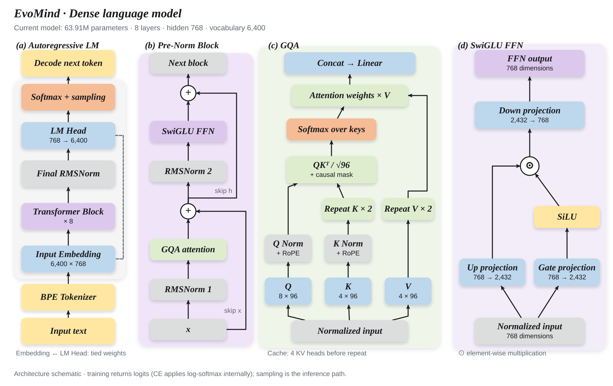
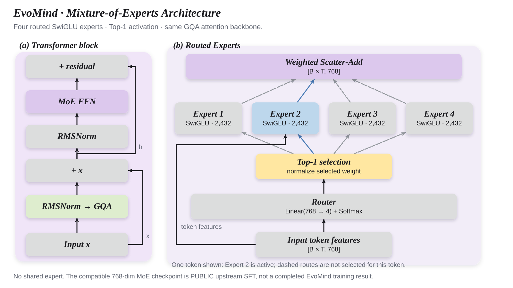
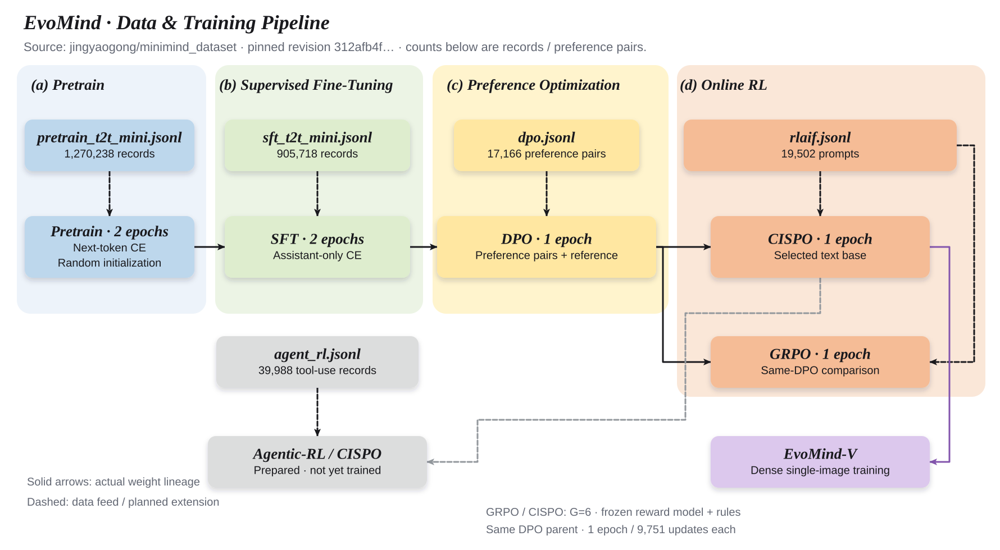

# EvoMind

**从文本训练到单图理解的个人大模型实践与技术报告**

中文 | [English](README_en.md)

[项目介绍](#项目介绍) · [快速复现](#快速复现) · [模型结构](#模型结构) · [训练过程](#训练过程) · [实验结果](#实验结果) · [视觉扩展](#视觉扩展)

## 项目介绍

我希望通过 EvoMind，把一个小型语言模型从预训练、指令微调到偏好优化、在线强化学习的过程完整跑通，再逐步扩展到视觉理解。项目由 YH 维护，使用个人电脑与单卡服务器完成训练。这份 README 按模型结构、数据流、训练曲线和独立评测组织，记录我实际做了什么、结果支持什么，以及还需要补齐什么。

当前文本模型约 **64M 参数，hidden size 768、8 层、6,400 词表**，已完成 Pretrain、SFT、DPO，以及从同一 DPO 权重出发的 GRPO / CISPO 对照。按既定工程筛选规则，CISPO 已被选为 Dense 单图训练的文本初始化；这一选择不表示 CISPO 显著优于 GRPO。

第一版范围是 **已验收文本基座 → Dense 单图完整训练 → 原定六图评测 → 单图网页推理 → 技术报告**。截至 2026-09-12 的记录，单图正式训练仍在进行，最终权重与网页验收待完成。多图、视频和 MoE 视觉列入后续扩展。视觉代码与记录发布在 [evomind-v 分支](https://github.com/HuanYn/evomind/tree/evomind-v)，本机使用独立 Git checkout 管理。

这个仓库主要包含：

- 模型结构与 Tokenizer：RMSNorm、RoPE、Q/K Norm、GQA、SwiGLU，以及 Dense / MoE 实现。
- 文本训练：预训练、Assistant-only SFT、DPO、GRPO / CISPO 和优化器边界续训。
- 实验分析：训练曲线、七项中英文客观题评测、思考开关、EOS / 复读及工具调用诊断。
- 机制复现：同一 rollout 多次更新的 GRPO / CISPO 短对照，记录重要性比率与剪裁触发情况。
- 本地体验：支持多轮对话、流式输出和思考开关的 EvoMind Studio。

> 本页的实测结果来自 Dense 文本模型。MoE 架构、Agent 入口和视觉扩展各自标明完成状态；模型权重与原始语料单独存放。

## 快速复现

以下命令都在仓库根目录执行。最小入口独立运行所选阶段，先用 CPU 检查模型，再准备正式训练所需的数据。

### 1. 安装环境

克隆项目并建立独立环境。PyTorch 请按显卡与 CUDA 版本安装；项目实际使用 Transformers 4.57.6。

```powershell
git clone --branch main https://github.com/HuanYn/evomind.git
cd evomind
python -m venv .venv
.venv\Scripts\Activate.ps1
python -m pip install -r requirements-minimal.txt
```

Linux 使用 `source .venv/bin/activate` 激活环境。最小依赖、可选评测依赖与完整命令见[复现指南](docs/REPRODUCIBILITY.md)。

### 2. 先验证模型链路

下面的命令用小配置在 CPU 上验证 Tokenizer、前向传播、loss 与反向传播。它用于检查环境与代码；正式结果来自后面的完整训练。

```powershell
python -B scripts/evomind_reproduce.py smoke
```

### 3. 数据与训练

下载固定版本的预训练/SFT 语料并记录来源和 SHA256：

```powershell
python -B scripts/evomind_prepare_assets.py text
```

正式训练使用独立的阶段入口。默认只打印命令计划，添加 `--execute` 才会启动训练；传给底层 trainer 的参数写在 `--` 后。下面先查看 SFT 的运行计划：

```powershell
python -B scripts/evomind_reproduce.py train sft --dry-run -- --device cuda --epochs 2 --batch_size 8 --accumulation_steps 2 --max_seq_len 768 --learning_rate 1e-5 --hidden_size 768 --num_hidden_layers 8 --from_weight pretrain
```

这条计划对应从 `out/pretrain_768.pth` 初始化的完整 SFT 配方；正式执行前需先完成预训练或准备兼容的父权重。复现本页的在线 RL 对照时，GRPO 和 CISPO 都要显式使用 `--from_weight dpo` 并指向同一个 DPO 权重目录。路径、完整五阶段命令、精度和续训参数详见[复现指南](docs/REPRODUCIBILITY.md)。

### 4. 本地聊天

安装 WebUI 依赖并启动页面，在侧边栏填入训练导出的 `.pth` 权重：

```powershell
python -m pip install streamlit==1.50.0
python -m streamlit run scripts/evomind_webui.py
```

当前加载器对应 **768 维、8 层、6,400 词表**模型，支持纯模型权重与含 `model` 字段的训练 checkpoint，并检查所有参数名与形状。MoE 开关需要结构匹配的 MoE 权重。页面较长上下文选项用于外推体验；当前主线 SFT 的实际长度为 768。界面用于体验多轮输入、流式输出和思考开关；页面截图或一次看起来合理的回答，不能替代后文的评测。

## 模型结构

### Dense：本轮实际训练的文本模型



图中主干表示 token 从输入到输出的路径，展开部分对应一个 Decoder Block。输入先经 RMSNorm，再投影为 Q/K/V；**Q/K Norm 和 RoPE 作用于 Q、K**，V 直接参与注意力加权。注意力输出经过线性投影与第一次残差相加，随后由 RMSNorm、SwiGLU 和第二次残差完成这一层。最后的 RMSNorm 与 LM Head 把隐藏状态转换为下一 token 的词表 logits，生成时再按采样参数选出 token。

| 配置 | EvoMind Dense |
|---|---:|
| 参数量 | 63,912,192 |
| hidden size / 层数 | 768 / 8 |
| Q 头 / KV 头 | 8 / 4 |
| head dimension | 96 |
| FFN intermediate size | 2,432 |
| 词表大小 | 6,400 |
| 位置编码 | RoPE |
| 归一化 | Pre-RMSNorm，Q/K Norm |
| FFN | SwiGLU |
| Embedding / LM Head | 共享权重 |

四个 KV 头服务八个 Q 头，每两个 Q 头共享一组 K/V；缓存保留四个 KV 头。SwiGLU 的 gate 与 up 两条投影均扩展到 2,432 维，逐元素相乘后再投影回 768 维。Embedding 与 LM Head 共享同一组权重。当前结果对应上述配置，早期 hidden size 384 / 16K 词表实验单独归档。

图示依据：[模型实现](model/model_minimind.py)、[本轮预训练/SFT 配置](configs/text_official_mini.json)；图中尺寸、参数统计口径与来源映射见[架构图来源说明](docs/README_DIAGRAM_SOURCES.md#dense-与-moe-架构)。

### MoE：相同注意力骨干，按 token 选择 FFN 专家



MoE 保留 Dense 的 Embedding、八层注意力骨干、归一化与 LM Head，在每层 FFN 位置放入四个独立的 SwiGLU 专家。Router 对每个 token 计算专家概率，经 Top-1 选择一个专家，专家输出按路由权重汇合后回到残差主干。当前实现没有额外共享专家；归一化后的 Top-1 权重为 1，训练时另有负载均衡辅助损失。稀疏路由减少单个 token 激活的专家数，但所有专家权重仍需存储。

当前结构匹配的 `full_sft_768_moe.pth` 来自上游公开 SFT 权重，已保留来源版本与 SHA256，原用于蒸馏教师和后续结构匹配准备。**本项目尚未自行完成这条 MoE 的预训练/SFT，也没有 Dense–MoE 受控质量结果。** 本页后面的训练曲线与成绩均属于 Dense。

图示依据：[MiniMindConfig / MOEFeedForward](model/model_minimind.py)、[公开权重准备入口](scripts/evomind_posttrain_assets.py)；专家数、Top-1 设置与公共权重来源见[架构图来源说明](docs/README_DIAGRAM_SOURCES.md#dense-与-moe-架构)。

本页三张图均提供 [SVG、PNG、PDF 与可编辑图源](figures/README.md)，可以放大查看或按相同布局重新生成。

## 训练过程

### 数据如何进入各阶段



图中数据输入与模型权重的箭头分别回答“这一阶段读什么”和“从哪组参数开始”。Pretrain 从随机初始化开始，SFT 继承 Pretrain，DPO 继承 SFT；完成 SFT/DPO 筛选后，GRPO 与 CISPO **分别从同一个 DPO checkpoint 初始化**。两条 RL 分支各自完成训练并接受评测，最终选中的 CISPO 进入 Dense 单图实验。Agent-CISPO 是选定文本基座上的后续工具能力分支，目前只完成数据与运行入口准备。

| 阶段 | 文件 | 源文件规模 | 数据处理与训练用途 | 状态 |
|---|---|---:|---|---|
| Pretrain | `pretrain_t2t_mini.jsonl` | 1,270,238 条 | `text` → BPE、BOS/EOS、截断与 padding；预测后续 token | 已完成 2 epoch |
| SFT | `sft_t2t_mini.jsonl` | 905,718 条 | `conversations` → 聊天模板；只监督 assistant 的有效回答 token | 已完成 2 epoch |
| DPO | `dpo.jsonl` | 17,166 对 | chosen / rejected 分别套用模板，比较回答区间的策略/参考 log-prob | 已完成 1 epoch |
| GRPO / CISPO | `rlaif.jsonl` | 19,502 条 | 对话前缀生成 prompt；每题在线采样 6 个回答，由奖励模型与规则评分 | 两分支各完成 1 epoch |
| Agent-CISPO | `agent_rl.jsonl` | 39,988 条 | 对话、工具定义与 `gt`，供多轮工具调用 rollout 使用 | 配置 1 epoch；准备中，未训练 |

文件来自同一公开文本数据集，下载版本固定为 `312afb4f76391145c6902f765bb51691c09a12f5`；数据与奖励模型链接列在文末。已训练阶段使用完整源文件；上表规模是源文件条数，具体截断、模板和标签由各阶段 Dataset 决定，不能换算为相同数量的有效监督 token。RLAIF 读取对话前缀，回答由当前策略在线生成；源文件最后一条回答不作为这轮 RL 的监督答案。

图示依据：[Dataset 与标签实现](dataset/lm_dataset.py)、[已完成训练及父权重记录](docs/results/text_training_20260911.json)、[文本基座选择](docs/TEXT_BASE_SELECTION.md)。数据行数已与本地原文件复核，完整 SHA256、版本、阶段来源及 Agent 状态见[数据流图来源说明](docs/README_DIAGRAM_SOURCES.md#文本数据与训练关系)。

### 阶段与超参数

| 阶段 | Epoch | Micro batch × 累积 | 长度 | 学习率 |
|---|---:|---:|---|---:|
| Pretrain | 2 | 32 × 8 | 340 | 5e-4 |
| SFT | 2 | 8 × 2 | 768 | 1e-5 |
| DPO | 1 | 4 × 1 | 1,024 | 4e-8 |
| CISPO | 1 | 1 × 2 | prompt 768 / generation ≤1,024 | 3e-7 |
| GRPO | 1 | 1 × 2 | prompt 768 / generation ≤1,024 | 3e-7 |

DPO 共更新 4,292 步，偏好损失 `beta=0.15`；两个在线 RL 分支各更新 9,751 步，每个问题生成 **G=6** 个回答。两者均使用 BF16 policy/reference 和同卡 FP32 奖励模型，RL 的 `beta=0.1`、`epsilon=0.2`、CISPO 上限 `epsilon_high=5`。正式对照每个 rollout 更新一次；K=4 短消融单独记录。

这些是最终运行记录中的参数。仓库同时保留早期“各分支从 SFT 独立初始化”和奖励模型 CPU 放置的配置草案；复现本页结果应以[完成回执中的实际参数](docs/results/text_training_20260911.json)为准。LoRA、蒸馏和 Agent-CISPO 保留扩展入口，当前没有本页可报告的正式训练结果。

### 训练目标

**预训练与 SFT** 都进行 next-token prediction。SFT 将用户、系统消息及 padding 对应标签设为忽略，只对 assistant 回答的有效 token 求交叉熵：

```math
\mathcal{L}_{\mathrm{SFT}}=-\frac{\sum_{t=1}^{T}m_t\log\pi_\theta(y_t\mid h_t)}{\sum_{t=1}^{T}m_t}.
```

其中 `m_t=1` 表示该 token 参与监督，`m_t=0` 表示忽略；`h_t` 表示输入问题和此前已经出现的回答 token。

**DPO** 比较当前策略与冻结参考模型对 chosen / rejected 的相对偏好：

```math
\begin{aligned}
\Delta_\theta &= \log\frac{\pi_\theta(y_w\mid x)}{\pi_{\mathrm{ref}}(y_w\mid x)}-\log\frac{\pi_\theta(y_l\mid x)}{\pi_{\mathrm{ref}}(y_l\mid x)},\\
\mathcal{L}_{\mathrm{DPO}} &= -\log\sigma(\beta\Delta_\theta).
\end{aligned}
```

**GRPO / CISPO** 先生成一组回答，由冻结的 InternLM2-1.8B-Reward 加规则项评分，再计算组内标准化优势。两者使用同样的奖励、生成预算与 KL 项，比较的是 policy loss 中的重要性权重处理方式。

### 训练曲线

以下曲线来自 EvoMind 的实际日志，保留原始波动，没有用平滑线替代原始观测。先明确两个口径：**microstep 是读取一个小批次，optimizer update 是完成一次参数更新；训练 loss 不是验证集 loss。** Dense 模型没有专家路由辅助损失，因此下面的 `aux_loss` 都为 0，总损失与主要损失的两条线会重合。

为避免只挑一个起点和终点，我还计算了首末窗口的均值：

| 阶段 | 统计量 | 每个窗口的观测数 | 首窗口均值 | 末窗口均值 | 变化 |
|---|---|---:|---:|---:|---|
| Pretrain | 训练 CE | 50 | 4.0164 | 1.8880 | 降低约 53.0% |
| SFT | Assistant-only 训练 CE | 50 | 1.8283 | 1.5127 | 降低约 17.3% |
| DPO | 训练 DPO loss | 10 | 0.6193 | 0.5629 | 降低约 9.1%，但并非单调下降 |
| CISPO | 训练 reward | 500 | -1.3880 | 0.1337 | 增加约 1.5216 分 |
| GRPO | 训练 reward | 500 | -1.3375 | 0.1212 | 增加约 1.4587 分 |

窗口按最终恢复轨迹上的日志观测取样，不是全部训练 token 的平均；不同阶段的 loss 定义不同，不能跨行比较大小。RL 每条记录是该次更新**最后一个累积 microbatch**中 G=6 个回答的均值，不是两个累积 microbatch 的整体均值。reward 可以为负，变化用分数差而非百分比表示。计算口径与来源哈希见[曲线统计](docs/results/training_curve_readout_20260911.json)。

#### 预训练：预测训练语料的能力逐渐形成


上图蓝色 `loss` 是总损失，橙色 `logits_loss` 是 next-token 交叉熵，两者重合；绿色 `aux_loss=0` 是 Dense 模型的正常情况。最早记录的 loss 为 7.5218，前期下降较快，后期主要在约 2 附近波动，最后一个记录点为 1.6464。首末 50 条记录的均值下降，比单看这个终点更能反映整体趋势。

下图是学习率，从 `5e-4` 按 cosine 降到 `5e-5`，这一轮**没有额外 warmup 段**。横轴约 79,390 个 microstep，不是 79,390 次参数更新：本阶段使用 8 次梯度累积。前期快速下降、后期变缓，说明训练语料上的预测误差在减小，但不能据此判断知识准确率、对话能力或是否过拟合；这些要结合后面的独立评测。

#### SFT：学习回答格式与指令响应，波动仍然存在


上图仍是 CE，但只监督 assistant 的回答 token。首末 50 条记录的均值从 1.8283 降至 1.5127，后段仍有明显起伏，并不是每一步都变好。不同批次的问题、回答长度和有效监督 token 数不同，小批次损失出现波动并不自动意味着训练不稳定；同样，也不能仅凭这些曲线排除过拟合。

下图学习率从 `1e-5` 降至 `1e-6`，用于较小幅度地调整预训练权重。横轴是约 226,430 个 microstep，本阶段累积 2 次再更新。SFT 与预训练的数据、监督区域不同，因此 **SFT loss 比预训练低，不等于模型能力按同样比例提升**。本图支持的是“对当前指令数据的拟合改善”，不是“已经成为可靠问答助手”。

#### DPO：偏好损失有改善，但少量日志点不能画出平滑结论


上图 `loss` 与 `dpo_loss` 重合，衡量模型是否相对冻结参考模型更偏向 chosen。策略与参考模型完全相同时，理论起点是 `-log(0.5)≈0.6931`；图中第一个点已经是训练后的记录，不要求恰好等于该值。本轮完成 4,292 次更新，但只保存了 43 条此类控制台观测，**横轴 43 不代表只训练了 43 步**。

观测 loss 在 0.4029～0.8503 间波动，首末 10 点均值从 0.6193 变为 0.5629；对应中位数却从 0.5872 变为 0.6011。因此可以描述均值降低，但不能说它持续、稳定地下降，更不能把最后一个低点 0.4321 当作验证集成绩。

**下图的学习率“阶梯”和末尾的 0 是日志精度造成的。** 原日志使用 `.8f` 格式，只保留八位小数；真实 cosine 学习率从 `4e-8` 降到 `4e-9`，较小值被显示为 `0.00000000`。这不是实际停止更新，也不是采用了阶梯调度。原图保留，以便与历史日志对应。

#### CISPO：训练奖励分布上移，loss 不能按 CE 理解


上图 `policy_loss` 包含停止梯度的重要性权重、正负优势、log-prob 和 KL 正则，它可以为正或为负，不能解释为“答错比例”。首末 500 次更新窗口的均值约为 0.05282 → 0.01560，曲线仍有尖峰。靠近 0 既不等于没有梯度，也不构成“训练已经收敛”的判据。

下图蓝线是当前训练回答组的 reward，首末窗口均值由 -1.3880 提高到 0.1337，说明模型生成的回答在**这套训练评分规则下**总体得分提高。但最后 500 条记录仍覆盖约 -3.08～3.38，不是每个问题都得到改善；问题也随训练批次变化，这不是固定问题集上的前后配对评测。橙色 `aux_loss` 线恒为 0。

reward 包含奖励模型与规则项，不是准确率，0 分也不是统一的及格线。可能存在对评分偏好的适应，不能仅靠 reward 上升排除 reward hacking；是否更会回答，要结合下文已有的客观题与生成诊断。

#### GRPO：loss 上升不等于退化，重点结合奖励与独立评测


上图的首末窗口 `policy_loss` 均值约为 0.000235 → 0.003972。这里不能套用“loss 越小，回答越好”的 CE 直觉：正式训练 K=1，同一组优势均值接近 0，更新前 ratio 接近 1，带正负号的策略项在平均时容易抵消，而图中的损失还包含 `beta × KL`。因此标量接近 0 **不表示策略梯度为 0**；后续数值上升也不能单独诊断为训练退化。

下图 reward 的首末窗口均值由 -1.3375 提高到 0.1212，最后 500 条仍在约 -3.20～3.25 之间明显波动。和 CISPO 一样，它反映训练评分下的变化，不是未见问题的成功率。两算法的 `policy_loss` 公式不同，不能因为 GRPO 的数值更小就判定它优于 CISPO；奖励差距也需与独立评测一起看。

RL 图横轴是日志观测序号，包含断点恢复前后的记录；具体更新步和 invocation 以原始 JSONL 为准，历史未保存的尾段不算作最终权重的额外更新。各阶段完成状态、父模型、最终权重哈希见[训练记录快照](docs/results/text_training_20260911.json)。

## 实验结果

### 客观题评测

使用 lm-evaluation-harness 0.4.13，完整 split、0-shot（任务默认值）、聊天模板、关闭 thinking、FP16、batch=1、seed=42。下表统一展示原始 `acc`（%）；长度归一化的 `acc_norm`、标准误、完整配置与文件哈希保存在[结果快照](docs/results/text_benchmarks_20260911.json)，两种指标不混填。

| 任务 | 题数 | SFT | DPO | CISPO | GRPO |
|---|---:|---:|---:|---:|---:|
| C-Eval valid | 1,346 | 22.81 | 22.73 | 22.88 | 23.18 |
| CMMLU | 11,582 | 25.02 | 25.02 | 24.93 | 24.99 |
| ARC-Easy | 2,376 | 29.92 | 30.01 | 30.09 | 30.13 |
| PIQA | 1,838 | 54.08 | 54.03 | 54.46 | 54.62 |
| OpenBookQA | 500 | 15.20 | 15.20 | 15.40 | 15.40 |
| HellaSwag | 10,042 | 26.98 | 26.98 | 26.95 | 26.94 |
| Social-IQA | 1,954 | 34.65 | 34.60 | 35.01 | 35.06 |

SFT/DPO 与 CISPO/GRPO 分别运行于本机和服务器。Harness 版本相同，但安装源码哈希不同，差异已记录在结果快照；此表是同任务、同主要设置的比较，不代表两台机器的软件环境逐位相同。

后训练在不同任务上有升有降，GRPO / CISPO 的差距较小。本轮实验没有建立二者通用能力差异的显著性证据。中文知识任务得分仍较低，这是当前小模型的主要能力限制。

### 生成与工具调用

固定提示词分别测试 thinking 开/关，保存完整回答、EOS、输出长度、token distinct-2 和 repeat-4。EOS 表示预算内是否生成结束符，repeat-4 衡量重复四元组占比；两者都需要结合内容阅读。工具调用使用固定示例与有界本地工具执行器，结果用于检查调用链路。

| 模型 | 关 thinking：EOS | 关 thinking：repeat-4 | 开 thinking：EOS | 开 thinking：repeat-4 |
|---|---:|---:|---:|---:|
| SFT | 8/8 | 14.72% | 8/8 | 19.94% |
| DPO | 8/8 | 11.31% | 8/8 | 22.44% |
| CISPO | 8/8 | 8.94% | 8/8 | 7.25% |
| GRPO | 8/8 | 8.94% | 8/8 | 7.19% |

每种设置包含 8 个固定问题，seed=42、temperature=0.85、top-k=50、top-p=0.95、生成上限 8,192 token。repeat-4 按回答分别计算再求均值。四个模型的 8 个工具示例均执行结束，`complete` 表示流程结束，不是工具答案准确率。[原始诊断汇总](docs/results/text_diagnostics_20260911.json)保留了这一口径。

<details>
<summary>一次真实生成：固定问题列表中的第一个问题</summary>

**Q：你有什么特长？**

**SFT：** 我是一个高效的小参数AI模型，能够处理各种任务和问题。我可以提供信息、解答问题、进行对话等。如果你有任何问题或需要帮助，随时告诉我！

**DPO：** 我是一个高效的小参数AI模型，能够处理各种任务和问题。我可以提供信息、解答问题、进行对话等，帮助用户更高效地解决问题。

完整回答、token ID 与来源哈希见[示例记录](docs/results/text_examples_20260911.json)。这里按固定序号展示，不据此判断能力优劣。

</details>

### Rollout-reuse 短消融

这是对已有机制的复现：先前设置 `updates_per_rollout=1`，没有充分观察同一批样本多次更新时的重要性比率变化。短对照中两算法之间条件匹配；相对正式训练，设置改为 **K=4、LR=1e-6、batch=1、累积=1**。每个分支 30 组 rollout、120 次更新、单个 seed，用于短程机制敏感性观察。

```math
r_t=\exp\!\left(\log\pi_\theta(y_t\mid h_t)-\log\pi_{\mathrm{old}}(y_t\mid h_t)\right).
```

`h_t` 是同一个问题和此前回答 token 构成的上下文；分子是当前策略，分母是生成这批回答时的旧策略。`r_t=1` 表示两者对这个 token 给出相同概率，偏离 1 表示策略已发生变化。

| 120 次更新的均值 | CISPO | GRPO |
|---|---:|---:|
| ratio p95 | 1.0370 | 1.0371 |
| GRPO policy 剪裁抑制率 | 0.5211%（反事实） | 0.5507% |
| CISPO cap 触发率 | 0.0000% | 0.0000%（反事实） |
| reference KL penalty | 0.00298 | 0.00292 |


这张图四个子图分别回答不同的问题：

| 子图 | 指标怎么读 | 本次观察与解释 |
|---|---|---|
| 左上：ratio p95 | 每次更新中有效 token 的重要性比率第 95 百分位数 | 出现重复的锯齿：同一 rollout 更新后 ratio 偏离 1，换成新 rollout/旧策略快照后又靠近 1。两算法逐步 p95 的均值约为 1.037，不是把所有 token 混在一起得到的全局 p95。 |
| 右上：ratio max | 每次更新中的最大重要性比率，用来观察尾部极端值 | CISPO/GRPO 全程最高值约 3.966/3.045，都没有超过 CISPO 的上限 5；均值接近 1 不能代替检查这些尾部值。 |
| 左下：原生干预率 | GRPO 的方向性剪裁抑制率，或 CISPO 的上限触发率；纵轴 0.2 表示 20% | GRPO 均值为 0.5507%，CISPO 为 0。但第一组 rollout 就贡献了各步 GRPO 抑制率之和的约 86.5%；去掉前 4 次更新，余下 116 次的均值仅 0.0768%。差异主要由早期尖峰贡献，不是整个训练过程中都存在大比例抑制。 |
| 右下：reference KL penalty | 对冻结参考模型的偏离惩罚；参考模型不同于不断刷新的 old policy | 两算法全程均值约为 0.00298/0.00292，前期都有约 0.053 的尖峰。新 rollout 的 ratio 回到 1，不要求相对固定 reference 的 KL 也归零。末点高低或个别峰值不能用于判断整体算法胜负。 |

右下图具体记录有效 token 上 `exp(d)-d-1` 的均值，其中 `d=logπ_ref-logπ_θ`，还未乘 `beta`。这是采样得到的惩罚估计，不是枚举整个词表计算的精确 KL。

GRPO 抑制率统计 `A>0 且 r>1.2` 或 `A<0 且 r<0.8` 的有效 token 比例；CISPO cap 率统计 `r>5`。两列对应不同干预机制：CISPO 即使达到 cap，仍可通过停止梯度的重要性权重训练 log-prob。该短实验展示剪裁条件的实际触发，不能单独推出最终质量或样本效率优势。

详情见[消融记录](docs/evaluation/ROLLOUT_REUSE_ABLATION_K4_20260911.md)，数据与出图命令见[复现指南](docs/REPRODUCIBILITY.md)。

## 视觉扩展

已按既定文本筛选规则选用 CISPO 最终权重进入 Dense 单图实验，GRPO 保留为同父权重对照。[选择依据、验收与单图训练合同](docs/TEXT_BASE_SELECTION.md)。这项选择不代表已证明视觉迁移收益。

视觉部分使用冻结的 SigLIP2 视觉塔，通过可训练 Projector 将图像特征映射到 768 维语言模型隐藏空间。当前一期聚焦 Dense 单图路线：一张 256×256 图片产生 64 个视觉 token，与文本 token 一同进入语言模型。当前正式配方中的 `freeze_llm=1` 训练 Projector 和语言模型首尾两个 Decoder Block，其余语言参数冻结。

```text
图片 → SigLIP2 视觉塔 → Projector → 视觉 token + 文本 token → LLM → 回答
```

| 阶段 | 要完成的工作 | 当前状态 |
|---|---|---|
| Dense 单图（V1） | 2,544,979 条训练记录、2 epoch；最终六图评测、网页和报告 | 正式训练进行中；最终权重、评测与网页验收待完成 |
| Dense 多图（后续） | 多张原图的输入组织、训练与受控对照 | 已有接口准备，正式训练延期 |
| Dense 视频（后续） | 抽帧、时间顺序与单帧对照 | 基线待实现和训练 |
| MoE 视觉（后续） | 结构匹配文本底座、相同视觉数据与评测 | 尚无正式视觉训练与对照结果 |

图像数据按原始图像哈希分组划分；本次 native 单图只读取训练集合，既有 val/test 原图不进入这轮训练。已有 global+2×2 五裁剪准备使用的是同一张原图的多个视图，不等于真正多图或视频。特征缓存只保存冻结视觉塔的输出，Projector 保持在线训练。原定六张图用于定性检查和生成诊断，不能代替通用视觉正确率。

视觉架构、数据处理、单图训练曲线与复现入口见 [evomind-v 技术报告](https://github.com/HuanYn/evomind/tree/evomind-v)。多图、视频和 MoE 的延期不影响第一版按单图范围验收。

## 代码与实验记录

```text
model/                       模型与 Tokenizer
dataset/lm_dataset.py        各阶段数据与标签构造
trainer/                     训练目标、rollout 与续训实现
scripts/evomind_reproduce.py 最小复现入口
scripts/evomind_webui.py     本地对话界面
scripts/evomind_*eval.py     自动评测与生成诊断
configs/                     训练配方与实验配置
test/                        模型、数据、恢复与损失测试
docs/results/                可公开的指标、哈希和小型原始记录
docs/assets/                 本项目的训练/实验曲线
figures/                     本项目的模型架构与数据流 SVG
```

运行产生的 `artifacts/`、数据集和 checkpoint 不进入普通 Git 提交。已有实验编排脚本保留在仓库，初次复现优先使用独立入口；每次新运行使用单独输出目录，保存配置、数据哈希和父权重哈希。更多步骤见[复现指南](docs/REPRODUCIBILITY.md)。

## 致谢与引用

EvoMind **基于 [MiniMind](https://github.com/jingyaogong/minimind) 开源项目进行复现与扩展**，文本代码起点为 `6fc918beb68a0d8c40452338df6319fe168014ba`；视觉部分基于 [MiniMind-V](https://github.com/jingyaogong/minimind-v)。我在此基础上完成了本仓库的训练实验、工程适配、后训练对照与结果记录。感谢原作者与社区贡献者。

- 文本语料：[minimind_dataset](https://huggingface.co/datasets/jingyaogong/minimind_dataset)
- 图文语料：[minimind-v_dataset](https://huggingface.co/datasets/jingyaogong/minimind-v_dataset)
- 奖励模型：[InternLM2-1.8B-Reward](https://huggingface.co/internlm/internlm2-1_8b-reward)

本仓库保留 [Apache-2.0 LICENSE](LICENSE) 与 [NOTICE](NOTICE.md)；数据和外部模型沿用各自发布许可。
