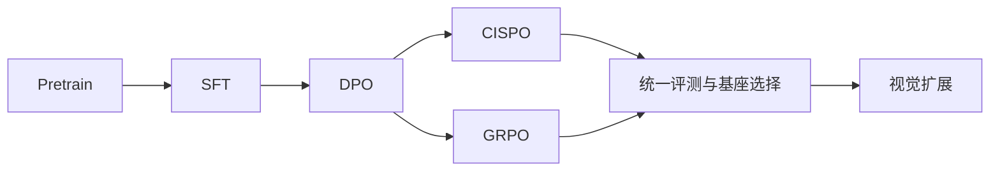
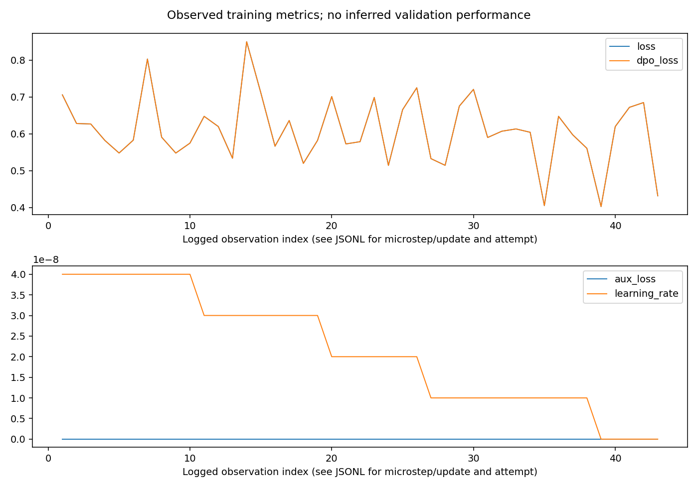
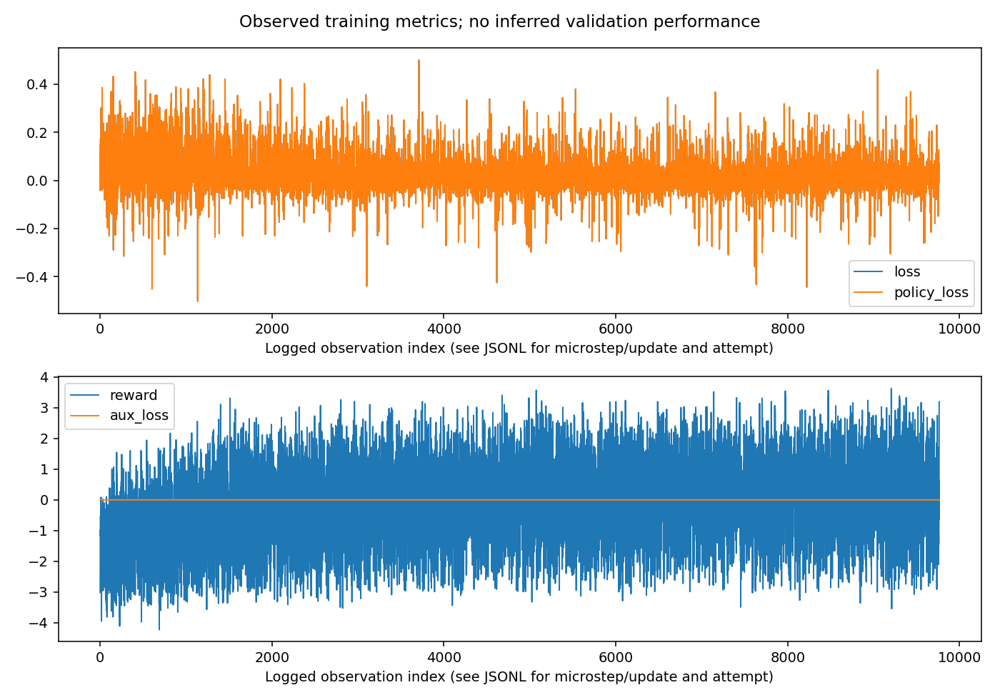
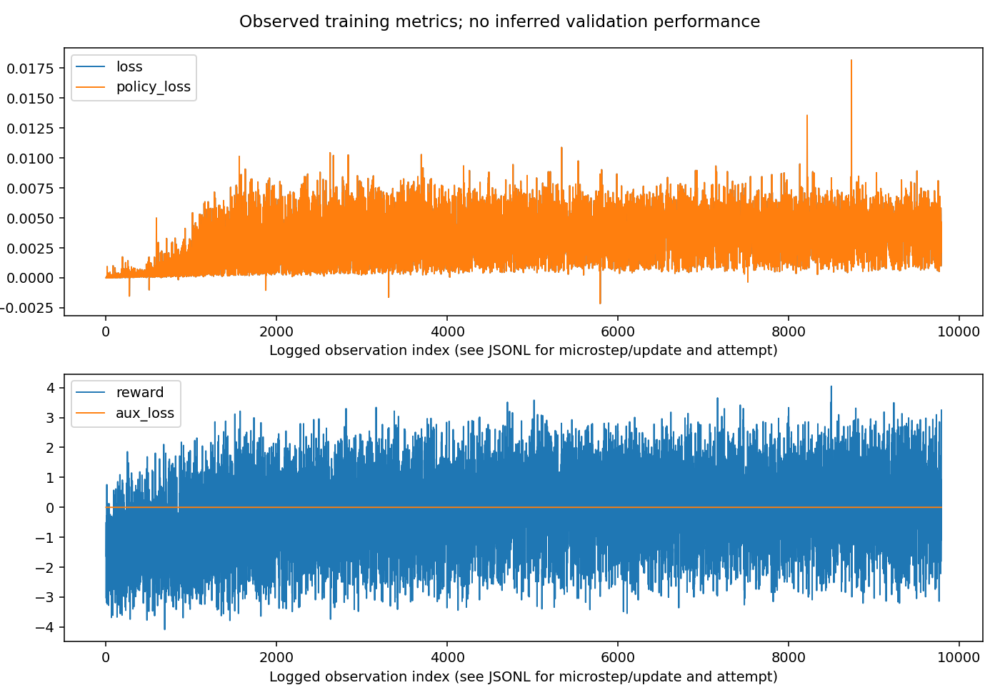
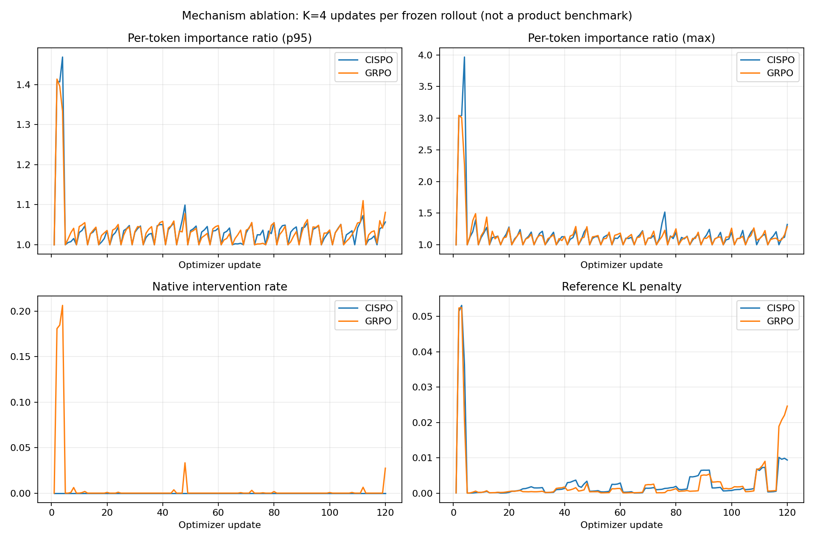

# EvoMind

**从文本基座到视觉理解的个人大模型实践项目**

中文 | [English](README_en.md)

[项目介绍](#项目介绍) · [快速复现](#快速复现) · [模型结构](#模型结构) · [训练过程](#训练过程) · [实验结果](#实验结果) · [视觉扩展](#视觉扩展)

## 项目介绍

我希望通过 EvoMind，把一个小型语言模型从预训练、指令微调到偏好优化、在线强化学习的过程完整跑通，再把它扩展到图像和视频理解。项目由 YH 维护，使用个人电脑与单卡服务器完成训练，记录每个阶段的数据、配置、曲线、权重关系和评测结果。

当前文本模型约 **64M 参数**，已完成 Pretrain、SFT、DPO，以及从同一 DPO 权重出发的 GRPO / CISPO 对照。视觉部分在 [evomind-v 分支](https://github.com/HuanYn/evomind/tree/evomind-v)推进。

这个仓库主要包含：

- 模型结构与 Tokenizer：RMSNorm、RoPE、Q/K Norm、GQA、SwiGLU，以及 Dense / MoE 实现。
- 文本训练：预训练、Assistant-only SFT、DPO、GRPO / CISPO 和优化器边界续训。
- 实验分析：训练曲线、七项中英文客观题评测、思考开关、EOS / 复读及工具调用诊断。
- 机制复现：同一 rollout 多次更新的 GRPO / CISPO 短对照，记录重要性比率与剪裁触发情况。
- 本地体验：支持多轮对话、流式输出和思考开关的 EvoMind Studio。

> 本次发布是文本阶段的代码与结果快照。模型权重和原始语料单独存放；视觉训练结果将在完成后更新。

## 快速复现

以下命令都在仓库根目录执行。最小入口独立运行所选阶段，先用 CPU 检查模型，再准备正式训练所需的数据。

### 1. 安装环境

克隆项目并建立独立环境。PyTorch 请按显卡与 CUDA 版本安装；项目实际使用 Transformers 4.57.6。

```powershell
git clone --branch main https://github.com/HuanYn/evomind.git
cd evomind
python -m venv .venv
.venv\Scripts\Activate.ps1
python -m pip install -r requirements-minimal.txt
```

Linux 使用 `source .venv/bin/activate` 激活环境。最小依赖、可选评测依赖与完整命令见[复现指南](docs/REPRODUCIBILITY.md)。

### 2. 先验证模型链路

下面的命令用小配置在 CPU 上验证 Tokenizer、前向传播、loss 与反向传播。它用于检查环境与代码；正式结果来自后面的完整训练。

```powershell
python -B scripts/evomind_reproduce.py smoke
```

### 3. 数据与训练

下载固定版本的预训练/SFT 语料并记录来源和 SHA256：

```powershell
python -B scripts/evomind_prepare_assets.py text
```

正式训练使用独立的阶段入口。默认只打印命令计划，添加 `--execute` 才会启动训练；传给底层 trainer 的参数写在 `--` 后。下面先查看 SFT 的运行计划：

```powershell
python -B scripts/evomind_reproduce.py train sft --dry-run -- --device cuda --epochs 2 --batch_size 8 --accumulation_steps 2 --max_seq_len 768 --learning_rate 1e-5
```

路径、完整五阶段命令、精度和续训参数详见[复现指南](docs/REPRODUCIBILITY.md)。

### 4. 本地聊天

安装 WebUI 依赖并启动页面，在侧边栏填入训练导出的 `.pth` 权重：

```powershell
python -m pip install streamlit==1.50.0
python -m streamlit run scripts/evomind_webui.py
```

当前加载器对应 **768 维、8 层**模型，支持纯模型权重与含 `model` 字段的训练 checkpoint，并检查所有参数名与形状。MoE 开关需要结构匹配的 MoE 权重。页面较长上下文选项用于外推体验；当前主线 SFT 的实际长度为 768。

## 模型结构

```text
文本 → BPE Tokenizer → Embedding
                         ↓
      8 × Transformer Block
      ├─ RMSNorm → Q/K/V → Q/K Norm → RoPE → GQA → 残差相加
      └─ RMSNorm → SwiGLU FFN → 残差相加
                         ↓
               RMSNorm → LM Head → 下一个 token
```

| 配置 | EvoMind Dense |
|---|---:|
| 参数量 | 63,912,192 |
| hidden size / 层数 | 768 / 8 |
| Q 头 / KV 头 | 8 / 4 |
| head dimension | 96 |
| FFN intermediate size | 2,432 |
| 词表大小 | 6,400 |
| 位置编码 | RoPE |
| 归一化 | Pre-RMSNorm，Q/K Norm |
| FFN | SwiGLU |
| Embedding / LM Head | 共享权重 |

四个 KV 头服务八个 Q 头，在每个 token 的注意力计算中共享 K/V；缓存保留四个 KV 头。Dense 与 MoE 代码使用相同的注意力结构，差异主要在 FFN。当前结果对应上述 Dense 配置，早期 19M / 16K 词表实验单独归档。

## 训练过程

### 数据

| 阶段 | 文件 | 源文件规模 | 训练用途 |
|---|---|---:|---|
| Pretrain | `pretrain_t2t_mini.jsonl` | 1,270,238 条 | 文本续写 |
| SFT | `sft_t2t_mini.jsonl` | 905,718 条 | 指令、多轮对话与模板学习 |
| DPO | `dpo.jsonl` | 17,166 对 | chosen / rejected 偏好优化 |
| GRPO / CISPO | `rlaif.jsonl` | 19,502 条 | 在线生成和奖励评分 |

文件来自同一公开文本数据集，下载版本固定为 `312afb4f76391145c6902f765bb51691c09a12f5`；数据与奖励模型链接列在文末。此轮使用完整源文件，具体模板处理与有效长度由各阶段 Dataset 决定，文件条数与有效监督 token 数是不同口径。

### 阶段与超参数



| 阶段 | Epoch | Micro batch × 累积 | 长度 | 学习率 |
|---|---:|---:|---|---:|
| Pretrain | 2 | 32 × 8 | 340 | 5e-4 |
| SFT | 2 | 8 × 2 | 768 | 1e-5 |
| DPO | 1 | 4 × 1 | 1,024 | 4e-8 |
| CISPO | 1 | 1 × 2 | prompt 768 / generation ≤1,024 | 3e-7 |
| GRPO | 1 | 1 × 2 | prompt 768 / generation ≤1,024 | 3e-7 |

DPO 共更新 4,292 步；两个在线 RL 分支各更新 9,751 步，每个问题生成 **G=6** 个回答。两者均使用 BF16 policy/reference 和同卡 FP32 奖励模型，`beta=0.1`、`epsilon=0.2`、CISPO 上限 `epsilon_high=5`。正式对照每个 rollout 更新一次；K=4 短消融单独记录。

### 训练目标

**预训练与 SFT** 都进行 next-token prediction。SFT 将用户、系统消息及 padding 对应标签设为忽略，只对 assistant 回答的有效 token 求交叉熵：

$$
\mathcal L_{\mathrm{SFT}}=-\frac{1}{\sum_t m_t}\sum_t m_t\log\pi_\theta(y_t\mid x,y_{<t}).
$$

**DPO** 比较当前策略与冻结参考模型对 chosen / rejected 的相对偏好：

$$
\mathcal L_{\mathrm{DPO}}=-\log\sigma\!\left(\beta\left[\log\frac{\pi_\theta(y_w\mid x)}{\pi_{\mathrm{ref}}(y_w\mid x)}-\log\frac{\pi_\theta(y_l\mid x)}{\pi_{\mathrm{ref}}(y_l\mid x)}\right]\right).
$$

**GRPO / CISPO** 先生成一组回答，由冻结的 InternLM2-1.8B-Reward 加规则项评分，再计算组内标准化优势。两者使用同样的奖励、生成预算与 KL 项，比较的是 policy loss 中的重要性权重处理方式。

### 训练曲线

以下曲线来自 EvoMind 的实际日志。横轴、attempt 与 loss 口径以图例为准；预训练/SFT 图中的 microbatch loss 是训练损失。








RL 图横轴是日志观测序号，包含断点恢复前后的记录；具体更新步和 invocation 以原始 JSONL 为准，历史未保存的尾段不算作最终权重的额外更新。各阶段完成状态、父模型、最终权重哈希见[训练记录快照](docs/results/text_training_20260911.json)。

## 实验结果

### 客观题评测

使用 lm-evaluation-harness 0.4.13，完整 split、0-shot（任务默认值）、聊天模板、关闭 thinking、FP16、batch=1、seed=42。下表统一展示原始 `acc`（%）；长度归一化的 `acc_norm`、标准误、完整配置与文件哈希保存在[结果快照](docs/results/text_benchmarks_20260911.json)，两种指标不混填。

| 任务 | 题数 | SFT | DPO | CISPO | GRPO |
|---|---:|---:|---:|---:|---:|
| C-Eval valid | 1,346 | 22.81 | 22.73 | 22.88 | 23.18 |
| CMMLU | 11,582 | 25.02 | 25.02 | 24.93 | 24.99 |
| ARC-Easy | 2,376 | 29.92 | 30.01 | 30.09 | 30.13 |
| PIQA | 1,838 | 54.08 | 54.03 | 54.46 | 54.62 |
| OpenBookQA | 500 | 15.20 | 15.20 | 15.40 | 15.40 |
| HellaSwag | 10,042 | 26.98 | 26.98 | 26.95 | 26.94 |
| Social-IQA | 1,954 | 34.65 | 34.60 | 35.01 | 35.06 |

SFT/DPO 与 CISPO/GRPO 分别运行于本机和服务器。Harness 版本相同，但安装源码哈希不同，差异已记录在结果快照；此表是同任务、同主要设置的比较，不代表两台机器的软件环境逐位相同。

后训练在不同任务上有升有降，GRPO / CISPO 的差距较小。本轮实验没有建立二者通用能力差异的显著性证据。中文知识任务得分仍较低，这是当前小模型的主要能力限制。

### 生成与工具调用

固定提示词分别测试 thinking 开/关，保存完整回答、EOS、输出长度、token distinct-2 和 repeat-4。EOS 表示预算内是否生成结束符，repeat-4 衡量重复四元组占比；两者都需要结合内容阅读。工具调用使用固定示例与有界本地工具执行器，结果用于检查调用链路。

| 模型 | 关 thinking：EOS | 关 thinking：repeat-4 | 开 thinking：EOS | 开 thinking：repeat-4 |
|---|---:|---:|---:|---:|
| SFT | 8/8 | 14.72% | 8/8 | 19.94% |
| DPO | 8/8 | 11.31% | 8/8 | 22.44% |
| CISPO | 8/8 | 8.94% | 8/8 | 7.25% |
| GRPO | 8/8 | 8.94% | 8/8 | 7.19% |

每种设置包含 8 个固定问题，seed=42、temperature=0.85、top-k=50、top-p=0.95、生成上限 8,192 token。repeat-4 按回答分别计算再求均值。四个模型的 8 个工具示例均执行结束，`complete` 表示流程结束，不是工具答案准确率。[原始诊断汇总](docs/results/text_diagnostics_20260911.json)保留了这一口径。

<details>
<summary>一次真实生成：固定问题列表中的第一个问题</summary>

**Q：你有什么特长？**

**SFT：** 我是一个高效的小参数AI模型，能够处理各种任务和问题。我可以提供信息、解答问题、进行对话等。如果你有任何问题或需要帮助，随时告诉我！

**DPO：** 我是一个高效的小参数AI模型，能够处理各种任务和问题。我可以提供信息、解答问题、进行对话等，帮助用户更高效地解决问题。

完整回答、token ID 与来源哈希见[示例记录](docs/results/text_examples_20260911.json)。这里按固定序号展示，不据此判断能力优劣。

</details>

### Rollout-reuse 短消融

这是对已有机制的复现：先前设置 `updates_per_rollout=1`，没有充分观察同一批样本多次更新时的重要性比率变化。短对照中两算法之间条件匹配；相对正式训练，设置改为 **K=4、LR=1e-6、batch=1、累积=1**。每个分支 30 组 rollout、120 次更新、单个 seed，用于短程机制敏感性观察。

$$
r_t=\exp(\log\pi_\theta(y_t\mid x,y_{<t})-\log\pi_{\mathrm{old}}(y_t\mid x,y_{<t})).
$$

| 120 次更新的均值 | CISPO | GRPO |
|---|---:|---:|
| ratio p95 | 1.0370 | 1.0371 |
| GRPO policy 剪裁抑制率 | 0.5211%（反事实） | 0.5507% |
| CISPO cap 触发率 | 0.0000% | 0.0000%（反事实） |
| reference KL penalty | 0.00298 | 0.00292 |



GRPO 抑制率统计 `A>0 且 r>1.2` 或 `A<0 且 r<0.8` 的有效 token 比例；CISPO cap 率统计 `r>5`。两列对应不同干预机制：CISPO 即使达到 cap，仍可通过停止梯度的重要性权重训练 log-prob。该短实验展示剪裁条件的实际触发，不能单独推出最终质量或样本效率优势。

详情见[消融记录](docs/evaluation/ROLLOUT_REUSE_ABLATION_K4_20260911.md)，数据与出图命令见[复现指南](docs/REPRODUCIBILITY.md)。

## 视觉扩展

视觉部分使用冻结的 SigLIP2 视觉塔，通过可训练 Projector 将图像特征映射到语言模型隐藏空间。

```text
图片 → SigLIP2 视觉塔 → Projector → 视觉 token + 文本 token → LLM → 回答
```

| 阶段 | 要完成的工作 | 当前状态 |
|---|---|---|
| Dense 单图 | 图文对齐、训练、生成与验收 | 数据和代码准备；结果待补 |
| Dense 多图 | 多图样本、输入组织、与单图受控对照 | 待正式训练 |
| Dense 视频 | 固定抽帧、时间顺序、与单帧对照 | 待完成基线 |
| MoE 视觉 | 结构匹配文本底座、相同视觉数据与评测 | 待 Dense 基线完成 |

图像数据按原始图像哈希分组划分，避免同图跨集合。特征缓存只保存冻结视觉塔的输出，Projector 保持在线训练。后续统一记录理解质量、重复/EOS、显存与推理延迟。

## 代码与实验记录

```text
model/                       模型与 Tokenizer
dataset/lm_dataset.py        各阶段数据与标签构造
trainer/                     训练目标、rollout 与续训实现
scripts/evomind_reproduce.py 最小复现入口
scripts/evomind_webui.py     本地对话界面
scripts/evomind_*eval.py     自动评测与生成诊断
configs/                     训练配方与实验配置
test/                        模型、数据、恢复与损失测试
docs/results/                可公开的指标、哈希和小型原始记录
docs/assets/                 本项目的训练/实验曲线
```

运行产生的 `artifacts/`、数据集和 checkpoint 不进入普通 Git 提交。已有实验编排脚本保留在仓库，初次复现优先使用独立入口；每次新运行使用单独输出目录，保存配置、数据哈希和父权重哈希。更多步骤见[复现指南](docs/REPRODUCIBILITY.md)。

## 致谢与引用

EvoMind **基于 [MiniMind](https://github.com/jingyaogong/minimind) 开源项目进行复现与扩展**，文本代码起点为 `6fc918beb68a0d8c40452338df6319fe168014ba`；视觉部分基于 [MiniMind-V](https://github.com/jingyaogong/minimind-v)。我在此基础上完成了本仓库的训练实验、工程适配、后训练对照与结果记录。感谢原作者与社区贡献者。

- 文本语料：[minimind_dataset](https://huggingface.co/datasets/jingyaogong/minimind_dataset)
- 图文语料：[minimind-v_dataset](https://huggingface.co/datasets/jingyaogong/minimind-v_dataset)
- 奖励模型：[InternLM2-1.8B-Reward](https://huggingface.co/internlm/internlm2-1_8b-reward)

本仓库保留 [Apache-2.0 LICENSE](LICENSE) 与 [NOTICE](NOTICE.md)；数据和外部模型沿用各自发布许可。
